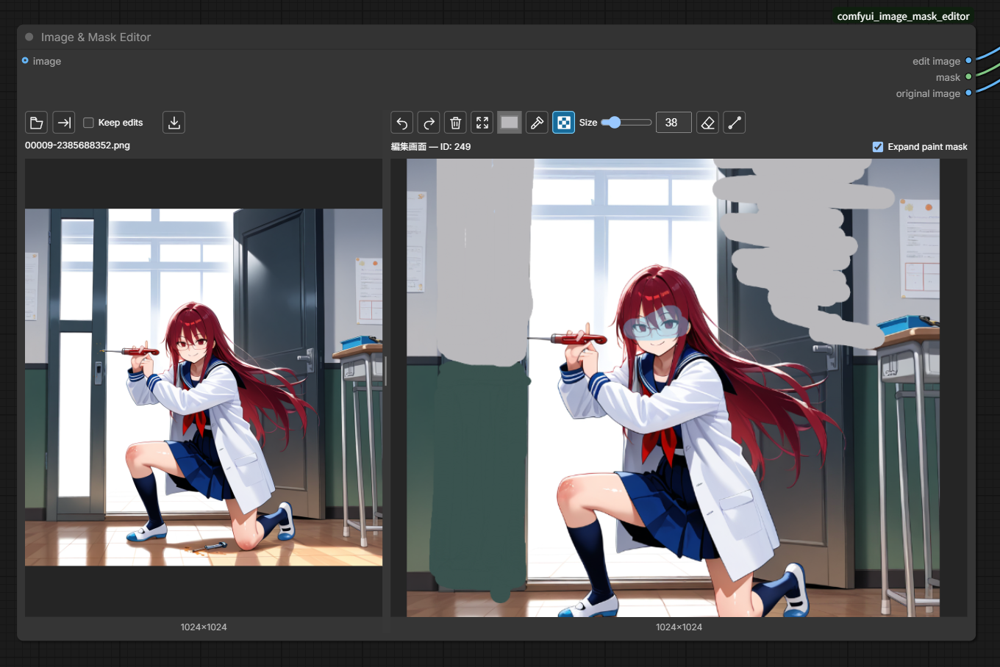
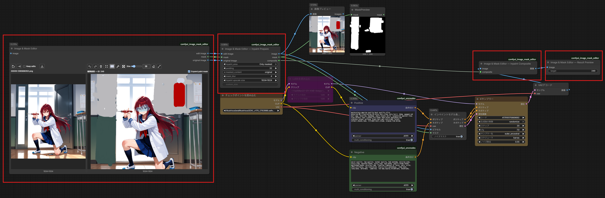

# Image & Mask Editor

## 制作の背景

AUTOMATIC1111やForgeのInpaint Sketchのように、画像へ色を描き込みながらマスクを設定する操作を、ComfyUIのノード内でも行いたいと思い、このノードを制作しました。

生成した画像をすぐに編集画面へ送り、修正を繰り返せる操作が便利で、ComfyUIでも同じように使えるものを探していました。しかし、求めていたものが見つからず、それまではForgeなどのInpaint Sketchを使って修正しており、ComfyUIとForgeなどのツールを行き来する手間を減らしたいと思ったことが、制作のきっかけです。

読み込み・生成結果のプレビューと編集画面を左右に配置し、生成した画像を編集画面へ送り直して、同じ箇所を繰り返し調整できるようにしています。色を描き込まず、マスクだけを設定することもできます。



左：読み込み画像／右：描画・マスクの編集画面

## インストール

ComfyUIの`custom_nodes`フォルダで以下を実行してください。

```sh
git clone https://github.com/Rest-1010/ComfyUI-Image-Mask-Editor.git
```

ノード検索で`Image & Mask Editor`を追加してください。Python側はComfyUIに含まれるPyTorch・NumPy・Pillowを使用します。

## 基本操作

1. 左側のLoad imageアイコン、または左側の画像エリアへのドラッグ＆ドロップで画像を読み込みます。
2. Send inpaintアイコンを押して、画像を右側の編集画面へ送ります。読み込みだけでは右側の編集内容は変わりません。
3. 右側で色を描き込む、または「マスクのみ」を選んで編集したい範囲を塗ります。
4. 下記の「ワークフローへの接続」を参考にノードを接続し、ワークフローを実行します。

アイコンの名前はマウスオーバーで確認できます。

Send inpaint横のKeep editsをオンにすると、転送時に描画とマスクを維持します。初期状態はオフで、転送時に両方をクリアします。クリアはUndoで戻せます。

## 編集ツール・表示操作

### 描画と色の選択

- ブラシ・マスクのみ・消しゴムを切り替えて編集します。Undo/Redoで操作を戻したり、やり直したりできます。
- ブラシサイズはSizeのスライダーまたは数値入力で設定します（1〜200）。編集画面でShift＋ホイールを奥へ回すと小さく、手前へ回すと大きくなります。
- 直線アイコンを選び、ドラッグで始点と終点を指定します。離すと確定し、もう一度アイコンを押すとフリーハンドに戻ります。直線は描画・マスクのみ・消しゴムに対応しています。
- Pick colorアイコンで色を取得します。
- 編集画面では右クリックでも色を取得できます。マスクの表示色は取得色に含まれません。
- 編集画面上部のExpand paint maskをオンにすると、色付き描画から作るマスクを周囲へ広げます。初期状態はオンです。描画の色と「マスクのみ」の範囲は広がりません。

### 表示の調整と画像保存

- 左右の画像はホイールで拡大縮小、Shift＋ドラッグで移動できます。
- 読み込み画面はダブルクリック、または新しい画像の読み込みで表示位置をリセットできます。
- 中央の仕切りを左右にドラッグして分割比率を変更します。ダブルクリックで初期比率に戻ります。両側の最低幅があるため、左側を大きく広げたい場合はノード自体の幅も広げてください。分割比率はワークフローに保存されます。
- 左側のSave imageアイコンで、プレビュー画像を元の解像度のPNGとしてダウンロードできます。保存場所はブラウザの設定に従い、右側の描画やマスクは合成されません。

## ワークフローへの接続

- `image`入力は任意です。接続した画像は実行後に読み込み画面へ表示されます。
- `edit image`出力は描画込みの画像、`mask`出力はマスク、`original image`出力は描画前の編集元画像です。

### Inpaint Prepare / Inpaint Composite

1. 編集ノードの`edit image` / `mask` / `original image`を、**Image & Mask Editor — Inpaint Prepare**の同名入力へ接続します。
2. PrepareのIMAGE/MASK出力をInpaintModelConditioningなどの生成処理へ接続します。
3. VAE DecodeのIMAGE出力を**Image & Mask Editor — Inpaint Composite**の`image`へ、Prepareの`composite`出力をCompositeの`composite`へ接続します。
4. CompositeのIMAGE出力を **Image & Mask Editor — Result Preview** の`image`入力端子へ接続すると、合成結果を読み込み画面へ戻せます。

※ **Image & Mask Editor — Result Preview** の`target`には、合成結果を戻したい **Image & Mask Editor** ノードのIDを設定します。IDは編集画面上部で確認できます。

### Inpaint Prepareの設定

- Inpaint areaのWhole pictureは画像全体、Only maskedはマスク周辺だけを生成処理へ渡します。新規ノードの初期値はOnly maskedです。PaddingはOnly maskedで含める周囲の余白です。
- Masked contentのoriginalは描画込み画像を使い、fillはマスク内を周囲の色で埋めます。初期値はoriginalです。
- Prepareのmask_blurは数値入力で設定します（0〜64px、初期値4）。0はぼかしなしです。色や編集画面の表示は変わりません。
- Inpaint upscale sizeはOnly maskedのときに設定できます。512×512／768×768／1024×1024相当を選べます。初期値は1024×1024です。縦横比を保って画像とマスクの生成範囲を拡大します。Whole pictureではグレーアウトし、元サイズのまま処理します。
- custom_sizeはOnly maskedでCustomを選んだ場合に設定できます。それ以外はグレーアウトします。例えば1200なら1200×1200相当です。

### Inpaint Compositeの動作

- 生成結果を元サイズへ戻して貼り付けます。
- Compositeは描画前の元画像へ合成します。マスクが空の場合は元画像を返します。

> [!IMPORTANT]
> **生成結果を読み込み画面へ戻す接続方法**
>
> 生成結果を読み込み画面へ戻す場合は、Composite（合成を使わない場合はVAE Decode）のIMAGE出力を **Image & Mask Editor — Result Preview** の`image`へ接続し、`target`で編集ノードのIDを選びます。**生成結果を編集ノードの入力へ直接戻す接続は避けてください。**

### 接続例

<a href="images/inpaint-workflow-example.png"></a>

画像をクリックすると元のサイズで確認できます。

上の画像はPrepare / Compositeを使う接続例です。

## 注意事項

### 再読み込みすると編集内容が失われます

同時に開いているワークフロー間の切り替えでは、左右の画像・描画・マスク・Undo/Redo履歴をメモリ上で保持します。実行後でも、ブラウザの再読み込みや終了で失われます。ワークフローを保存しても、新しい編集元・描画・マスクは復元されません。左側のSave imageはプレビュー画像だけの保存で、編集状態の保存ではありません。非表示のワークフローの編集内容もメモリを使用します。

- Keep editsがオンの場合、解像度が変わると描画・マスクは比例リサイズされます。Undo/Redoは転送後の画像サイズに合わせて維持されます。
- Undo/Redoは最大30操作、合計256MiBを目安としています。画像サイズや編集範囲によって戻せる回数は減ります。
- 複数ファイルをドロップした場合は最初の画像1枚を読み込みます。バッチ画像のプレビューも先頭の1枚で、Send inpaint後の編集・出力はその1枚が対象です。
- 保存するメタデータは生成時点の情報です。保存前に変更した設定は反映されません。編集レイヤーやUndo履歴を復元するための保存ではありません。ComfyUIでメタデータ保存を無効にしている場合、生成結果には埋め込みません。

## トラブル対処

- 「画像が見つかりません。Load imageから読み込み直してください」と表示された場合は、Load imageから画像を読み込み直してください。読み込みが成功するまでSend inpaintは使えません。

## ライセンス

Copyright (c) 2026 Rest-1010

このプロジェクトは GNU General Public License v3.0 のみ（SPDX: `GPL-3.0-only`）で公開しています。全文は[LICENSE](LICENSE)をご覧ください。
