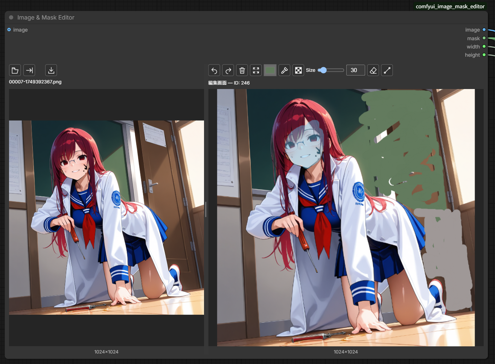

# Image & Mask Editor

バージョン1.0.5です。正式な版番号は同梱の`VERSION`ファイルに記録しています。フォルダ名・内部ノード名は変更しません。

## 制作の背景

AUTOMATIC1111やForgeのInpaint Sketchのように、画像へ色を描き込みながらマスクを設定する操作を、ComfyUIのノード内でも行いたいと思い、このノードを制作しました。

生成した画像をすぐに編集画面へ送り、修正を繰り返せる操作が便利で、ComfyUIでも同じように使えるものを探していました。しかし、求めていたものが見つからず、それまではForgeなどのInpaint Sketchを使って修正しており、ComfyUIとForgeなどのツールを行き来する手間を減らしたいと思ったことが、制作のきっかけです。

読み込み・生成結果のプレビューと編集画面を左右に配置し、生成した画像を編集画面へ送り直して、同じ箇所を繰り返し調整できるようにしています。色を描き込まず、マスクだけを設定することもできます。



左：読み込み画像／右：描画・マスクの編集画面

## インストール

ComfyUIの`custom_nodes`フォルダで以下を実行し、ComfyUIを再起動してブラウザをCtrl＋F5で更新してください。

```sh
git clone https://github.com/Rest-1010/ComfyUI-Image-Mask-Editor.git
```

ノード検索で`Image & Mask Editor`を追加してください。Python側はComfyUIに含まれるPyTorch・NumPy・Pillowを使用します。

## 基本操作

1. 左側のLoad imageアイコン、または左側の画像エリアへのドラッグ＆ドロップで画像を読み込みます。
2. Send inpaintアイコンを押して、画像を右側の編集画面へ送ります。読み込みだけでは右側の編集内容は変わりません。
3. 右側で色を描き込む、または「マスクのみ」を選んで編集したい範囲を塗ります。
4. IMAGE/MASK出力を生成処理へ接続し、ワークフローを実行します。

アイコンの名前はマウスオーバーで確認できます。

## 編集ツール・表示操作

### 描画と色の選択

- ブラシ・マスクのみ・消しゴムを切り替えて編集します。Undo/Redoで操作を戻したり、やり直したりできます。
- ブラシサイズはSizeのスライダーまたは数値入力で設定します（1〜200）。編集画面でShift＋ホイールを奥へ回すと小さく、手前へ回すと大きくなります。
- 直線アイコンを選び、ドラッグで始点と終点を指定します。離すと確定し、もう一度アイコンを押すとフリーハンドに戻ります。直線は描画・マスクのみ・消しゴムに対応しています。
- Pick colorアイコンで色を取得します。対応ブラウザでは周辺拡大付きの標準スポイトで画面全体から取得できます。非対応または起動エラー時は画像内スポイトへ切り替わります。画像内スポイトはもう一度アイコンを押すかEscapeで解除できます。
- 編集画面では右クリックでも色を取得できます。マスクの表示色は取得色に含まれません。

### 表示の調整と画像保存

- 左右の画像はホイールで拡大縮小、Shift＋ドラッグで移動できます。
- 読み込み画面はダブルクリック、または新しい画像の読み込みで表示位置をリセットできます。
- 中央の仕切りを左右にドラッグして分割比率を変更します。ダブルクリックで初期比率に戻り、フォーカス中は左右矢印キーでも調整できます。両側の最低幅があるため、左側を大きく広げたい場合はノード自体の幅も広げてください。分割比率はワークフローに保存されます。
- 左側のSave imageアイコンで、プレビュー画像を元の解像度のPNGとしてダウンロードできます。保存場所はブラウザの設定に従います。右側の描画やマスクは合成されません。

## ワークフローへの接続

- `image`入力は任意です。接続した画像は実行後に読み込み画面へ表示されます。
- IMAGE/MASK出力をインペイントの生成処理へ接続します。`width` / `height` のINT出力は右側のIMAGE出力の実サイズで、生成処理の幅・高さへ接続できます。
- 生成結果を左側へ戻す場合は、VAE DecodeのIMAGE出力を **Image & Mask Editor — Result Preview** の`image`へ接続し、`target`で編集ノードのIDを選びます。生成結果を編集ノードの入力へ直接戻す接続は避けてください。

## 注意事項

### 再読み込みすると編集内容が失われます

同時に開いているワークフロー間の切り替えでは、左右の画像・描画・マスク・Undo/Redo履歴をメモリ上で保持します。実行後でも、ブラウザの再読み込みや終了で失われます。ワークフローを保存しても、新しい編集元・描画・マスクは復元されません。左側のSave imageはプレビュー画像だけの保存で、編集状態の保存ではありません。非表示のワークフローの編集内容もメモリを使用します。

- 編集・実行時に、このノードから編集用の画像ファイルを自動保存することはありません。ただし、画像データがComfyUIの実行履歴やSave ImageのPNGメタデータに記録される場合はあります。
- Send inpaintで画像を差し替えても、描画・マスク・Undo/Redoは維持されます。解像度が変わる場合は比例リサイズされます。
- Undo/Redoは最大30操作、合計256MiBを目安としています。画像サイズや編集範囲によって戻せる回数は減ります。
- 複数ファイルをドロップした場合は最初の画像1枚を読み込みます。バッチ画像のプレビューも先頭の1枚で、Send inpaint後の編集・出力はその1枚が対象です。

## トラブル対処

- 「画像が見つかりません。Load imageから読み込み直してください」と表示された場合は、Load imageから画像を読み込み直してください。読み込みが成功するまでSend inpaintは使えません。

## ライセンス

Copyright (c) 2026 Rest-1010

このプロジェクトは GNU General Public License v3.0 のみ（SPDX: `GPL-3.0-only`）で公開しています。全文は[LICENSE](LICENSE)をご覧ください。
